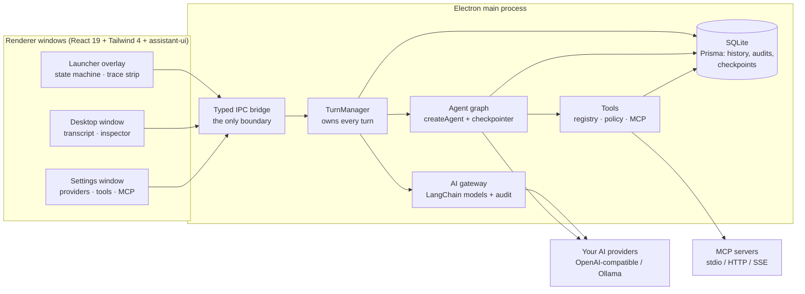

<div align="center">


# Desktop Assistant
### The AI launcher that lives in your system tray

[](https://github.com/neuronection/desktop-assistant/releases)
[](docs/STATUS.md)
[](LICENSE)
[](#quick-start)
[](https://www.electronjs.org/)
[](https://www.typescriptlang.org/)
[](https://sqlite.org/)

<br>

  <p>
    <small>Part of</small><br>
    <picture>
      <source media="(prefers-color-scheme: dark)" srcset="https://neuronection.com/logos/neuronection-dark.svg">
      
    </picture>&nbsp;&nbsp;&nbsp;<picture>
      <source media="(prefers-color-scheme: dark)" srcset="https://neuronection.com/logos/neuronection-wordmark-dark.svg">
      
    </picture>
  </p>

**Website**: [neuronection.com](https://neuronection.com) · **Repository**: [neuronection/desktop-assistant](https://github.com/neuronection/desktop-assistant)

</div>

> **Your history stays on your machine.** One local SQLite database, keys in your OS
> keyring, no accounts and no telemetry — the only traffic leaving your machine is the
> AI calls you configure yourself.

---

## Table of contents

- [What is Desktop Assistant?](#what-is-desktop-assistant)
- [What's different](#whats-different)
- [Features](#features)
- [Agentic tools, safely](#agentic-tools-safely)
- [Quick start](#quick-start)
  - [Install from the latest release](#install-from-the-latest-release)
  - [Run from source (developers)](#run-from-source-developers)
  - [Build executables](#build-executables)
  - [Connect an AI provider](#connect-an-ai-provider)
- [Architecture at a glance](#architecture-at-a-glance)
- [Keyboard shortcuts](#keyboard-shortcuts)
- [Supported providers](#supported-providers)
- [Documentation](#documentation)
- [Tech stack](#tech-stack)
- [Scope & limitations](#scope--limitations)
- [Status & roadmap](#status--roadmap)
- [Community & support](#community--support)
- [Contributing](#contributing)
- [Security](#security)
- [License](#license)

---

## What is Desktop Assistant?

A desktop AI assistant that lives in your system tray and is summoned from anywhere
with a global hotkey — ask something, paste a screenshot, dictate a thought, or let it
act on your computer with your approval. Two windows, one codebase: a compact
**launcher bar** for quick asks (a few pixels, no response area until the answer
starts) and a full **desktop window** with docked history, a trace inspector, and
export — with live handoff between them, even mid-response.

Under the hood it is an **agentic assistant with a trust boundary**: a LangGraph tool
agent (screen capture, shell, files, apps, web, MCP servers) where every tool declares
a risk class, state-changing calls pause for your approval on an in-window card, and
destructive tools confirm every single time. Every call is audited locally.

It is **beta** software (formerly known as *AI Launcher*).

## What's different

- **Launcher-first, not chat-app-first.** Summon with a hotkey, ask, dismiss — the
  window is a few pixels tall until the answer streams in, then grows only as far as
  it needs. Slash commands (`/screenshot`, `/shell`, `/open`) run tools instantly,
  no model round-trip.
- **Tools that ask first.** Risk-classed tools (read-only / state-changing /
  destructive) with per-tool grants (once / this session / always) — and destructive
  tools are *confirmed every single time*, no setting can bypass it.
- **MCP built in.** Connect Model Context Protocol servers over stdio, streamable
  HTTP, or SSE from Settings → Tools; their tools join the agent with the same
  approval gates. Server secrets live in the OS keyring, never in config files.
- **Bring your own LLM — including local.** OpenAI, Groq, Together, Fireworks,
  any OpenAI-compatible endpoint, or fully local via Ollama. Pick a model per
  conversation, or set a default for everything.
- **Two windows, live handoff.** Start a turn in the launcher, press `Ctrl+D`, and
  keep watching it in the desktop window — streaming survives window hides and
  approvals resolve from either window.
- **Resumable turns.** Agent state checkpoints into the local database, so a turn
  paused at an approval survives even an app restart.

## Features

### Summon & answer

- **Global hotkey** — summon/dismiss from anywhere (configurable), tray icon with
  quick actions always a click away.
- **Launcher state machine** — idle composer → thinking trace strip (phase, elapsed,
  step chips) → streaming response → done, with a full expanded transcript one
  `Ctrl+E` away.
- **Live turn trace** — every thinking/tool/streaming step as a compact chip strip in
  the launcher and a full expandable timeline in the desktop inspector.
- **Real-time streaming** — token-level rendering with markdown, code highlighting,
  math (KaTeX) and diagrams.
- **Voice input** — dictate via any Whisper-compatible speech-to-text endpoint.
- **Attachments** — PDFs, images, or a live screen capture; drag files onto either
  window.
- **Conversation history** — persisted locally in SQLite with search, per-conversation
  model override, and Markdown/JSON export.

### Act on your computer

- **Native tools** — screen capture (feeds vision models), system info, clipboard,
  running apps, web fetch (robots-aware), file browse/read/write/move/delete inside
  folders you explicitly grant, open URLs/paths/apps, notifications, volume and
  brightness, and more.
- **Shell with guardrails** — batch-only commands, working directory confined to
  granted folders, scrubbed environment, hard timeout and output caps.
- **MCP servers** — bring your own tools over stdio/HTTP/SSE; per-server and per-tool
  kill switches, allowlists, health checks and reconnection.
- **Slash commands** — `/screenshot`, `/shell <command>`, `/open <url | path | app>`
  for launcher-speed actions without a model call.
- **Full audit** — every tool call (executed or denied) recorded locally with outcome,
  duration and how it was approved.

### Desktop mode

- **Docked session sidebar**, full-height transcript, drag-and-drop attachments.
- **Inspector** — live/persisted trace timeline with step details, turn meta,
  last-message attachments, a searchable tool catalog, per-conversation model
  override, and Markdown/JSON export.
- **Remembered geometry** — bounds and maximized state persist; the window hides
  instead of closing.

### Private by default

- **Keys in the OS keyring** — provider, STT and MCP secrets never touch
  `config.json`, the database, or logs; masked everywhere in the UI.
- **Local-only history** — SQLite in your user-data directory; delete it and the
  app is gone.
- **Default-deny approvals** — unanswered approval requests auto-deny after 60 s;
  cancelling during an approval counts as a denial; everything is audited.
- **Hardened renderer** — context isolation, sandboxed production renderer, strict
  CSP, and a typed IPC bridge as the only boundary.

## Agentic tools, safely

Execution capability is designed around a trust boundary rather than bolted on:

- **Risk classes are mandatory.** Every tool declares `read-only`,
  `state-changing`, or `destructive`. Read-only tools run; state-changing tools
  ask unless you granted them; destructive tools ask **every time** — grants never
  bypass the class.
- **Approvals are human-in-the-loop pauses**, not best-effort prompts. The agent
  interrupts; both windows show a card (compact in the launcher, rich with editable
  arguments on desktop); resolution is idempotent across windows and auto-denies
  after 60 s.
- **Destructive calls serialize.** Even when the model batches several calls, they
  run one at a time, each approved individually.
- **Granted roots confine the filesystem.** File and shell tools resolve every path
  against folders you picked via the OS folder picker; traversal is rejected.
- **MCP output is untrusted input.** Server tools join namespaced
  (`mcp__server__tool`), default to the state-changing class, and their results are
  treated as observations — never as instructions.
- **Everything is audited** — LLM calls to `ai_calls`, tool calls to `tool_calls`
  (args hash, outcome, duration, `approved_by`), all local.

## Quick start

### Install from the latest release

Download the installer for your platform — the links always fetch the
latest build:

| Platform | File | Link |
|---|---|---|
| Windows | `Desktop-Assistant-windows-setup.exe` | [download](https://github.com/neuronection/desktop-assistant/releases/latest/download/Desktop-Assistant-windows-setup.exe) |
| Linux (AppImage) | `Desktop-Assistant-linux.AppImage` | [download](https://github.com/neuronection/desktop-assistant/releases/latest/download/Desktop-Assistant-linux.AppImage) |
| Linux (deb) | `Desktop-Assistant-linux.deb` | [download](https://github.com/neuronection/desktop-assistant/releases/latest/download/Desktop-Assistant-linux.deb) |
| macOS (Intel) | `Desktop-Assistant-macos.dmg` | [download](https://github.com/neuronection/desktop-assistant/releases/latest/download/Desktop-Assistant-macos.dmg) |
| macOS (Apple Silicon) | `Desktop-Assistant-macos-arm64.dmg` | [download](https://github.com/neuronection/desktop-assistant/releases/latest/download/Desktop-Assistant-macos-arm64.dmg) |

Verify downloads against the `SHA256SUMS.txt` published with each release.
All installers and older versions: [Releases](https://github.com/neuronection/desktop-assistant/releases/latest).

### Run from source (developers)

Prerequisites: **Node 20+** (and on first install, network access for the Prisma
engine).

```bash
git clone https://github.com/neuronection/desktop-assistant.git
cd desktop-assistant
npm install
npm run prisma:generate
npm run dev
```

### Build executables

```bash
npm run dist
```

Distributables land in `release/` (Linux AppImage/deb, Windows NSIS, macOS DMG).
Prebuilt binaries are published on the releases page with each tagged release.

### Connect an AI provider

Open **Settings → API Settings → Add provider** (OpenAI, Groq, Together, Fireworks,
Ollama, or any OpenAI-compatible endpoint), paste your API key — it goes into your OS
keyring — then pick a default chat model. For fully local operation point a provider
at Ollama; for voice input configure **Settings → STT**.

## Architecture at a glance



Renderers never touch the OS, the database, or provider SDKs — the typed preload
bridge is the only boundary. The main process owns the entire turn lifecycle,
broadcasts phase events to every window, and runs the tool agent behind the policy
engine; secrets resolve in main at call time and never cross back. Deep dive:
[docs/architecture.md](docs/architecture.md).

## Keyboard shortcuts

| Shortcut | Action |
|----------|--------|
| **Global hotkey** | Summon/hide from anywhere (configurable) |
| **Escape** | Collapse response → hide to system tray |
| **Ctrl+E** | Expand/collapse the full transcript (launcher) |
| **Ctrl+D** | Open desktop mode (launcher) |
| **Ctrl+Q** | Quit application |
| **Ctrl+S** | Open settings |
| **Enter** | Send message |
| **Shift+Enter** | New line |

## Supported providers

| Provider | API URL | Docs |
|----------|---------|------|
| OpenAI | `https://api.openai.com/v1` | [Docs](https://platform.openai.com/docs/quickstart) |
| Groq | `https://api.groq.com/openai/v1` | [Docs](https://console.groq.com/docs/quickstart) |
| TogetherAI | `https://api.together.xyz/v1` | [Docs](https://docs.together.ai/docs/introduction) |
| FireworksAI | `https://api.fireworks.ai/inference/v1` | [Docs](https://docs.fireworks.ai/getting-started/introduction) |
| Ollama (local) | `http://localhost:11434/v1` | [Docs](https://github.com/ollama/ollama#quickstart) |

Any OpenAI-compatible endpoint works — add it with its base URL and key in settings.

## Documentation

- [Architecture](docs/architecture.md) — process model, security model, AI layer, tools & approvals
- [IPC surface](docs/ipc.md) — the full renderer↔main channel registry and rules
- [Development](docs/development.md) — commands, verification gate, data locations
- [Packaging](docs/packaging.md) — builds and release flow
- [Current status](docs/STATUS.md) — single source of truth for what exists
- [Changelog](CHANGELOG.md) — every user-visible change

## Tech stack

| Layer | Technology |
|---|---|
| Shell | Electron (main/preload in TypeScript strict) |
| Renderer | React 19 + Vite + Tailwind 4 + [`@neuronection/assistant-ui`](https://github.com/neuronection/assistant-ui) |
| AI | LangChain + LangGraph behind one gateway (`createAgent` tool agent, HITL approvals, persistent checkpointer) |
| Tools | Native catalog + MCP (`@langchain/mcp-adapters`), zod-validated, risk-classed |
| Storage | SQLite via Prisma (history, `ai_calls`/`tool_calls` audits, agent checkpoints) |
| Secrets | OS keyring via Electron `safeStorage` |
| Packaging | electron-builder (AppImage/deb, NSIS, DMG), tag-driven release workflow |
| Tooling | ESLint flat + TypeScript + Vitest, `npm run verify` gate |

## Scope & limitations

Honest boundaries — not every limitation is a bug:

- **In development.** The first tagged release awaits the GitHub org transfer;
  until then, run from source or `npm run dist` locally.
- **Single user, single machine.** Local profile, no accounts, no sync, no remote
  access.
- **AI features need a provider.** Without a configured model the launcher still
  works — tool slash commands run without one — but chat needs at least one provider.
- **Tool results need the right model.** Screenshot results reach the model as
  images and need a vision-capable backend; models without tool-calling fall back to
  plain streaming chat automatically.
- **Destructive tools confirm every time.** By design there is no setting to
  auto-approve them.
- **MCP servers are user-configured.** The app never installs or suggests servers;
  stdio servers run local commands you configure, with their secrets in the keyring.
- **Manual verification pending.** The automated gate (lint, typecheck, 200+ tests,
  build) is green in CI; accessibility (axe) and per-desktop-environment visual
  passes are tracked in [docs/STATUS.md](docs/STATUS.md).

## Status & roadmap

`docs/STATUS.md` is the single source of truth for phase and module status. Headline
next steps: the first tagged family release, the on-target manual matrix
(a11y/keyboard/visual passes, packaged smoke boot), and the groomed backlog
(scheduled prompts, selection context, local-docs RAG, per-conversation personas).

## Community & support

Questions: [Discord](https://discord.com/invite/SZCXNTwv) ·
Bugs & feature requests: [Issues](https://github.com/neuronection/desktop-assistant/issues) ·
Support development: [Buy Me a Coffee](https://buymeacoffee.com/neuronection)

## Contributing

Contributions are welcome. Set up a dev environment via
[Quick start](#quick-start), then run the verification gate before every commit:

```bash
npm run verify   # prisma generate + lint + typecheck + vitest + build
```

Docs are part of the change: behavior updates land together with their docs and a
CHANGELOG entry (see `AGENTS.md` for the workflow). See
[CONTRIBUTING.md](CONTRIBUTING.md) for the ground rules.

## Security

Found a vulnerability? Do not open a public issue — see
[SECURITY.md](SECURITY.md) for the private disclosure process.

<!-- NEURONECTION:ECOSYSTEM:START -->
---

<div align="center">

### Part of the Neuronection family

**Desktop Assistant** is one of four connected, open-source (Apache-2.0) AI assistants
for life's big decisions — structured data instead of text dumps, AI that explains
its reasoning, and you in control of your information.

<table>
  <tr>
    <td width="50%" align="center" valign="top">
      <picture>
        <source media="(prefers-color-scheme: dark)" srcset="https://neuronection.com/logos/health-light.svg">
        
      </picture>
      <br>
      <a href="https://neuronection.com/en/health/"><strong>Health Assistant</strong></a>
      <br><sub>Self-hosted, privacy-first health records — lab results, biomarkers, documents and AI-powered insights into your own data.</sub>
      <br><sub><a href="https://github.com/health-assistant-io/health-assistant">GitHub</a> · <a href="https://health-assistant.io">health-assistant.io</a></sub>
    </td>
    <td width="50%" align="center" valign="top">
      <picture>
        <source media="(prefers-color-scheme: dark)" srcset="https://neuronection.com/logos/career-light.svg">
        
      </picture>
      <br>
      <a href="https://neuronection.com/en/career/"><strong>Career Assistant</strong></a>
      <br><sub>A mapped universe of jobs — family tree + relation graph, AI match scoring and university pathways, built for students deciding their future.</sub>
      <br><sub><a href="https://github.com/neuronection/career-assistant">GitHub</a> · <a href="https://github.com/neuronection/career-assistant/tree/main/docs">Docs</a></sub>
    </td>
  </tr>
  <tr>
    <td width="50%" align="center" valign="top">
      
      <br>
      <a href="https://neuronection.com/en/study/"><strong>Study Assistant</strong></a>
      <br><sub>A local-first study workbench, in browser or on desktop — AI-powered course library, handwriting, chat and practice; math-first, subject-agnostic.</sub>
      <br><sub><a href="https://github.com/neuronection/study-assistant">GitHub</a> · <a href="https://github.com/neuronection/study-assistant/tree/main/docs">Docs</a></sub>
    </td>
    <td width="50%" align="center" valign="top">
      
      <br>
      <a href="https://neuronection.com/en/desktop/"><strong>Desktop Assistant</strong> <sub>· this repo</sub></a>
      <br><sub>A system-tray AI launcher for Windows, Linux and macOS — global hotkey, streaming chat, voice input, attachments; local-only history.</sub>
      <br><sub><a href="https://github.com/neuronection/desktop-assistant">GitHub</a> · <a href="https://github.com/neuronection/desktop-assistant/tree/main/docs">Docs</a></sub>
    </td>
  </tr>
</table>

Created and maintained by [Ilias Chatzopoulos](https://github.com/constLiakos)
· [LinkedIn](https://www.linkedin.com/in/ilias-chatzopoulos-aabb22163/)
· [info@neuronection.com](mailto:info@neuronection.com)

[neuronection.com](https://neuronection.com) — one ecosystem, four guides
· [♥ Support development](https://buymeacoffee.com/neuronection) · star what you use

</div>
<!-- NEURONECTION:ECOSYSTEM:END -->

## License

Apache-2.0 — see [LICENSE](LICENSE) for details.

