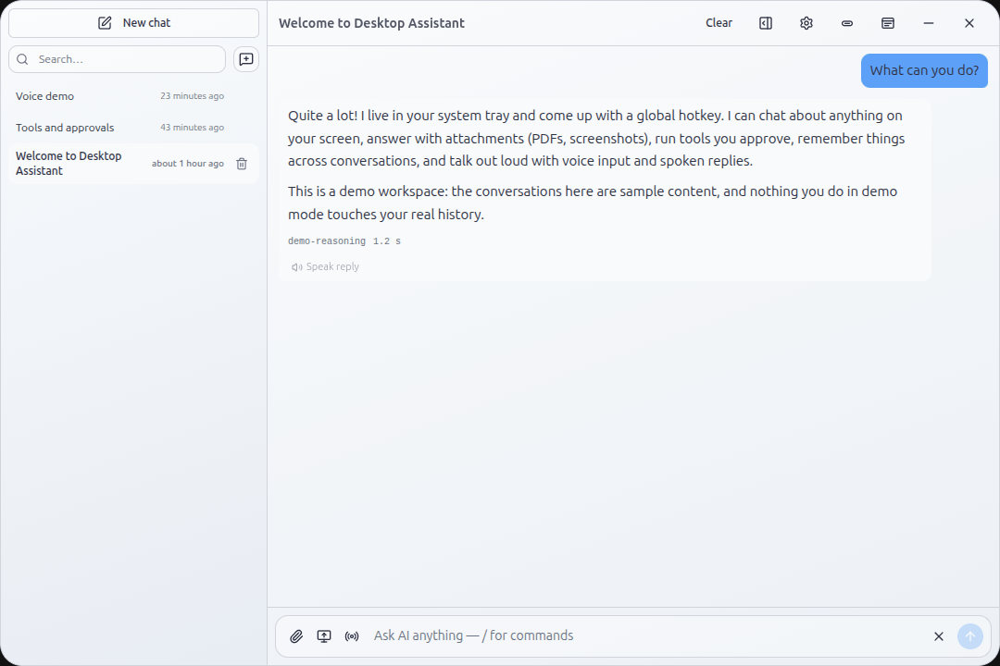
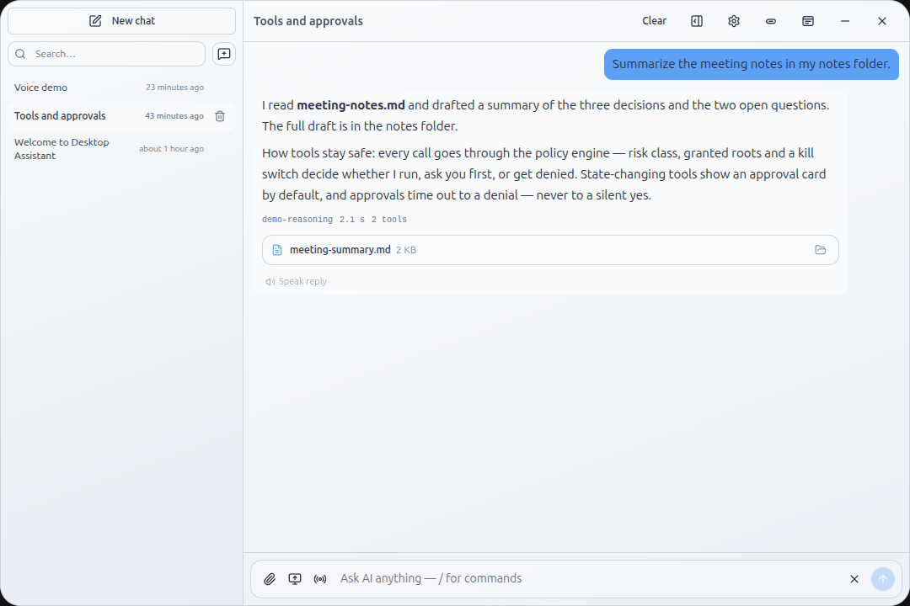

<!--
  AUTO-GENERATED by scripts/ui-capture/gallery.mjs (family template).
  Do not edit by hand — re-run the capture script to regenerate.
  To add a page, add a scene in scripts/ui-capture/scenes.mjs.
-->

# Desktop Assistant — Visual Tour

Welcome to the visual tour of Desktop Assistant. These reproducible screenshots showcase the app's windows and flows, captured from the real running application (demo mode, seeded conversations) over the DevTools protocol.

> Mobile views: not captured this run — pass `--viewport mobile` to `./scripts/capture_ui.sh` to generate.

## Launcher

### launcher-chat

_Launcher chat — the seeded demo conversation opens in the overlay itself._

> ⚠️ No desktop screenshot yet for **launcher-chat**. Run `./scripts/capture_ui.sh -- --scene launcher-chat --viewport desktop`.

### launcher

_The hotkey launcher — summon the assistant from anywhere, ask, dismiss._

> ⚠️ No desktop screenshot yet for **launcher**. Run `./scripts/capture_ui.sh -- --scene launcher --viewport desktop`.

### launcher-calc

_Mini tool — the calculator evaluates live as you type in the launcher._

> ⚠️ No desktop screenshot yet for **launcher-calc**. Run `./scripts/capture_ui.sh -- --scene launcher-calc --viewport desktop`.

### launcher-translate

_Mini tool — the translate pad renders a live translation (local demo engine)._

> ⚠️ No desktop screenshot yet for **launcher-translate**. Run `./scripts/capture_ui.sh -- --scene launcher-translate --viewport desktop`.

## Desktop chat

### desktop-chat

_Desktop window — full conversations with the seeded demo history._

### desktop-tools

_Tool trace — a conversation where the assistant ran tools and wrote a file artifact._

## Settings

### settings-general

_Settings — general pane of the settings window._

> ⚠️ No desktop screenshot yet for **settings-general**. Run `./scripts/capture_ui.sh -- --scene settings-general --viewport desktop`.

### settings-api

_Settings — AI provider setup (BYOK)._

> ⚠️ No desktop screenshot yet for **settings-api**. Run `./scripts/capture_ui.sh -- --scene settings-api --viewport desktop`.
